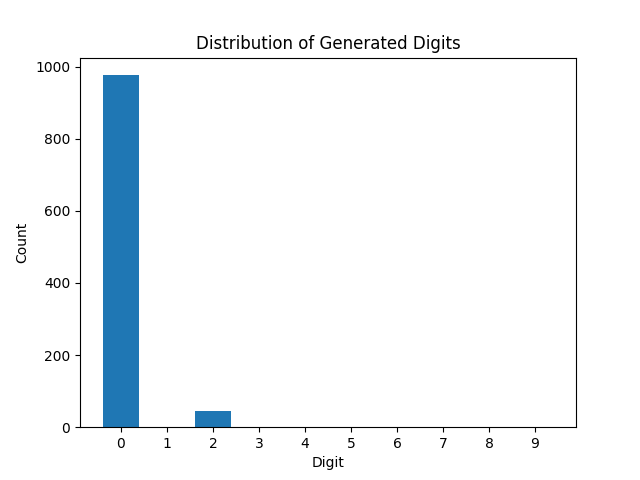

# dpo-toy

MNIST example for dpo vs sft in diffusion model.

This example show the effiency between sft and dpo to increase the density of digit 2.
(the learning rate, batchsize is same)

* Conclusion
- DPO is efficient at changing density preference
- SFT should be capble of doing the same, but need much more training budget
- If doing DPO without sft loss, the model could generated ood sample
- 0.1 * dpo\_loss + 1 * sft_loss is good at this experiment

## DDPM

## 1. Unconditional MNIST Diffusion Model
### generated sample

### digits distribution

The digit 2 is some how bias in this generative model. We want to increase digit 2 probablities in the following experiments by dpo of sft.

## 2. DPO trained for 2 epochs(0.1xdpo\_loss + 1.0 x sft\_loss)
Do DPO to increase the digit 2 density.
Works really well, generate digit 2 most of the time.
### generated sample

### digits distribution

## 3. SFT train for 5 epoch
The digit 2 density has only increased little.
### generated sample

### digits distribution

## sft train for 15 epoch
The digit 2 density has only increased much, but even taking 7 times training budeget, the effect is not so promising as DPO.
### generated sample

### digits distribution

## sft with negative learning train for 2 epoch
not statble
### generated sample

### digits distribution

## sft with negative learning train for 15 epoch
The digit 2 density has only increased much, but even taking 7 times training budeget, the effect is not so promising as DPO.
### generated sample

### digits distribution

## dpo trained for 2 epoch(1.0 dpo loss * 1.0 sft loss)
OOD Samples have beed genearted. DPO loss is too large
### generated sample

### digits distribution

## dpo trained for 2 epoch(dpo loss only)
OOD Samples have beed genearted.(all being cliped to 1)
### generated sample

### digits distribution

## flow matching
## flow matching Unconditional Generation
### generated sample

### digits distribution

## flow matching dpo
### generated sample

### digits distribution

## flow matching sft 5 epoch
### generated sample

### digits distribution

## flow matching sft 15 epoch
### generated sample

### digits distribution

